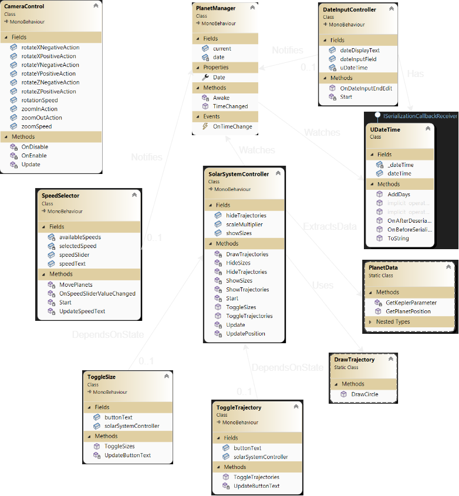
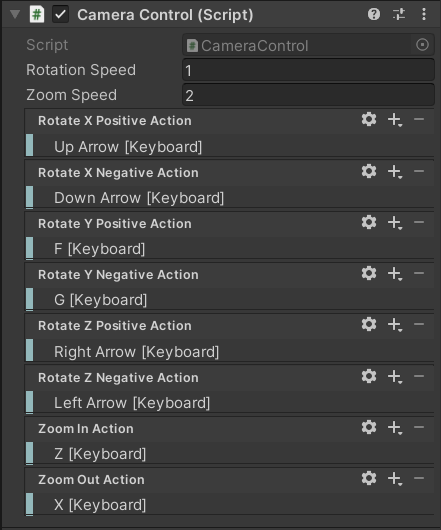

# PlanetVis

## Context

This projects aims to visualize planets trajectories in Unity using the Kepler elliptic model. Planets positions are calculated using Kepler's approximation formula. The projects implements an MVC design pattern logic.

## UML Diagram

The image bellow shows the UML class diagram of the project.

## Implemented Features

1. ****************************************************Camera zoom and rotation:****************************************************
    
    In this section, I implemented some classic camera behaviours: rotating on the X, Y and Z-axis, and zooming/unzooming. Using InputActions in the InputSystem unity package, we can add actions via bindings (up/down arrow keys, left/right arrow keys, F/G, and Z/X).
   
   
https://github.com/lasryanass/PlanetVis/assets/92301128/6fa6da12-ffd5-4ffc-8afb-0798937e3259

2. ****************************************************Show/Hide the planets orbits via the UI:****************************************************
    
    Using buttons logic, I controlled when the planets’ orbits will be shown. The orbits are simple circles centered on the sun, which is in the origin, and have a radius of the distance between the planet and the sun. As the data follows the more sophisticated Kepler laws. The real orbits are elliptic. Thus, sometimes the planets are shown out of orbit. The orbit circles are drawn using an algorithm that relies on linerendering: The more lines in a polygon, the more it approaches a circle.
   
https://github.com/lasryanass/PlanetVis/assets/92301128/61e17ece-f8ab-45a2-8242-aaac029603cf

3. **********************************Change the planets scale via UI (Realistic view vs Adapted view):**********************************
    
    Using a button, it is fairly simple to change the scale of the planets via the ***localScale*** attribute of every planet’s *transform*. The adapted view’s purpose is to focus on the planets while not caring about how little or big they look: Mercury and Mars are very small whereas Jupiter and Saturn are giants.

https://github.com/lasryanass/PlanetVis/assets/92301128/25d64347-4d19-4d43-8bac-d035bf9b11d8
    
4. **Add a date time via the UI:**
    
    In this section, I added an InputField in which we can add a text which will later be verified in an input controller script and formated as a MM/dd/YYYY datetime. The controller script then notifies the PlanetManager by changing the date attribute to the parsed date. This causes the solar system controller script to get notified of the change and update the planet positions according to the DateTime given.

https://github.com/lasryanass/PlanetVis/assets/92301128/ceb6882e-f361-452d-920d-68300fa06a5e
    
5. **Create a UI customizable dynamic mode that shows planets in orbit motion:**
    
    Using a UI slider component with whole number values, I defined 3 modes of planet’s motion: {0, 1, 2}. When slider is set to 0, the planets don’t move. When it’s set to 1, the planets move at the rate of 50 days/second. When it’s set to 2, the planets move at double speed (100 days/second). The implementation logic is simple. Using the InvokeReapeting method that runs every 0.1 second (10 times a second), we use add 5 or 10 days (depending on the slider value) to the datetime. This triggers a change event in PlanetManager, which notifies the subscribed solar system controller: The planet’s positions are then updated. Doing so 10 times a seconds gives the illusion that they’re moving!

https://github.com/lasryanass/PlanetVis/assets/92301128/32449fdb-1f05-4dab-8410-1863276467be
